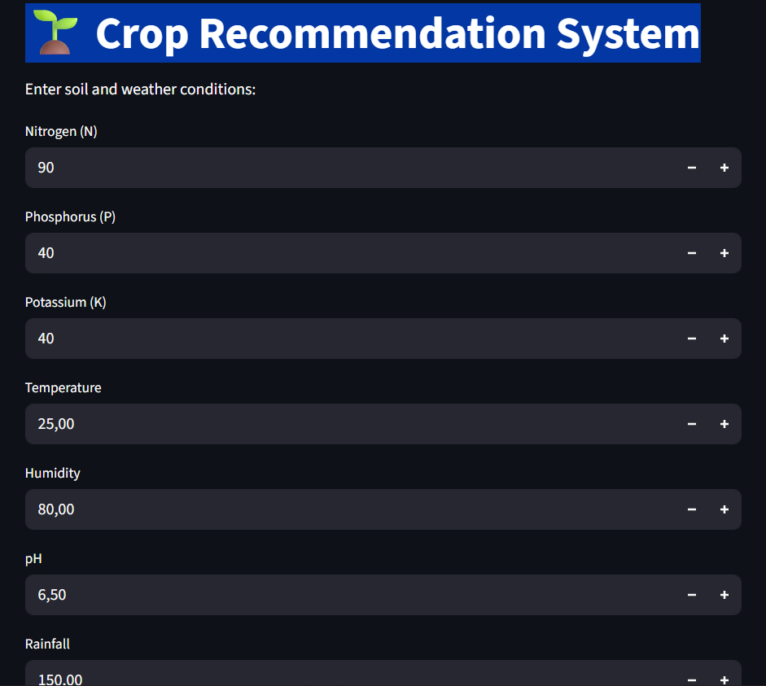
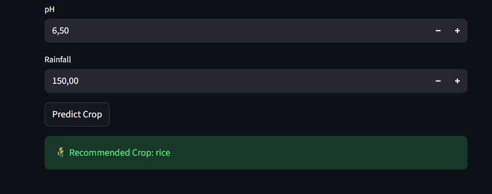

# 🌱 AgriTech Crop Advisor

**Machine Learning Project** | **Crop Recommendation System**  

This project is a simple yet practical **Machine Learning-based Crop Recommendation System** that predicts the best crop to grow based on soil and weather conditions. The system is implemented in **Python** and comes with a **web interface built with Streamlit**, making it interactive and easy to use.  

---


## 💡 Project Motivation

Agriculture is the backbone of many economies, but choosing the right crop for given soil and weather conditions can be challenging. This system helps **farmers and agritech enthusiasts** make informed decisions by using **data-driven predictions**.

---

## 🧰 Features

- Predicts the most suitable crop based on:
  - Nitrogen (N)
  - Phosphorus (P)
  - Potassium (K)
  - Temperature
  - Humidity
  - pH
  - Rainfall
- Interactive **Streamlit web app** for user-friendly predictions
- Uses **Random Forest Classifier** for robust predictions
- Displays feature importance to understand which factors affect the crop recommendation most

---
## 📸 Demo



## 📂 Dataset

For this mini project, a **sample dataset** with soil and weather conditions was created manually.  
Columns include:

| Feature      | Description |
|-------------|------------|
| N           | Nitrogen content of soil |
| P           | Phosphorus content |
| K           | Potassium content |
| temperature | Average temperature (°C) |
| humidity    | Humidity (%) |
| pH          | Soil pH |
| rainfall    | Rainfall (mm) |
| label       | Crop type (target) |

> In a real-world scenario, this can be replaced with **public crop datasets**.

---

## ⚙️ Installation

1. Clone the repository:

```bash
git clone https://github.com/Ezzouzi-Fatima-Ezzahrae/agritech-crop-advisor.git
cd agritech-crop-advisor
```
2. install the dependencies : 

python -m pip install -r requirements.txt

3. Run the Streamlit app:

streamlit run app.py

🧠 How It Works

- The model is trained on soil and weather data using Random Forest Classifier.

- User inputs values in the Streamlit app.

- The system predicts the most suitable crop.

- Feature importance is calculated to see which soil or weather parameters impact decisions the most.

🔍 Model Evaluation

- Model accuracy on the test data: ~95% (based on small sample dataset)

- Confusion matrix used for evaluating predictions

- Feature importance provides insight into which variables influence predictions the most

🚀 Future Improvements

- Integrate a real-world dataset with more samples and crops

- dd more ML algorithms like SVM, Gradient Boosting for comparison

- Add image-based plant disease detection for an advanced agritech system

- Deploy the app online for real users (Streamlit Cloud or Heroku)

👩‍💻 Author

Fatima Ezzahrae – Engineering Student & AI Enthusiast

📜 License

This project is licensed under the MIT License – see the LICENSE
file for details.